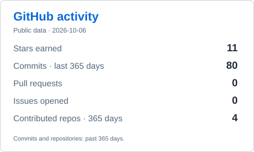
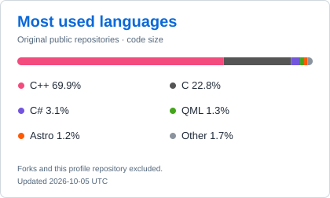

  <a href="https://www.halomoon.cn/">
    <picture>
      <source media="(max-width: 600px) and (prefers-reduced-motion: reduce) and (prefers-color-scheme: dark)" srcset="assets/profile/intro-static-mobile-dark.svg">
      <source media="(max-width: 600px) and (prefers-reduced-motion: reduce)" srcset="assets/profile/intro-static-mobile-light.svg">
      <source media="(max-width: 600px) and (prefers-color-scheme: dark)" srcset="assets/profile/intro-animated-mobile-dark.svg">
      <source media="(max-width: 600px)" srcset="assets/profile/intro-animated-mobile-light.svg">
      <source media="(prefers-reduced-motion: reduce) and (prefers-color-scheme: dark)" srcset="assets/profile/intro-static-dark.svg">
      <source media="(prefers-reduced-motion: reduce)" srcset="assets/profile/intro-static-light.svg">
      <source media="(prefers-color-scheme: dark)" srcset="assets/profile/intro-animated-dark.svg">
      
    </picture>
  </a>

<a href="https://www.halomoon.cn/">Blog</a>

  <picture>
    <source media="(prefers-color-scheme: dark)" srcset="assets/profile/stats-dark.svg">
    
  </picture>
  <picture>
    <source media="(prefers-color-scheme: dark)" srcset="assets/profile/languages-dark.svg">
    
  </picture>

  <picture>
    <source media="(prefers-reduced-motion: reduce) and (prefers-color-scheme: dark)" srcset="assets/contributions/activity-static-dark.svg">
    <source media="(prefers-reduced-motion: reduce)" srcset="assets/contributions/activity-static-light.svg">
    <source media="(prefers-color-scheme: dark)" srcset="assets/contributions/snake-dark.svg">
    
  </picture>

