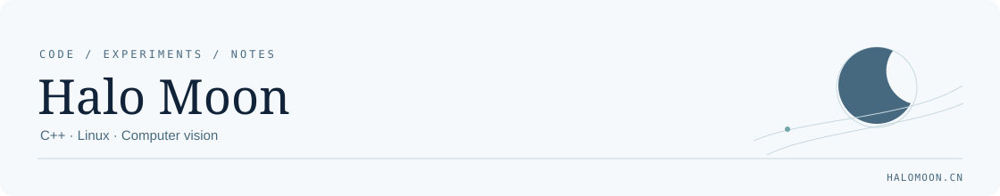

<picture>
  <source media="(prefers-color-scheme: dark)" srcset="assets/profile-dark.svg">
  
</picture>

# Hi, I'm Halo Moon

关注 **Linux 与嵌入式、机器视觉和 C++ 工程工具**，也把实现过程与实验心得整理成技术笔记。

I explore **Linux and embedded systems, computer vision, and C++ tooling** — and document what I learn along the way.

**[技术博客 · Blog](https://www.halomoon.cn/)** · **[学习笔记 · Notes](https://github.com/Hole333/HaloMoon-Notes)**

## 精选项目 / Selected work

### [Structured-light Lab](https://github.com/Hole333/PostgraduateResearch/tree/main/3d_scan)

单相机 / 投影仪与双目三维重建实验：从光追图像生成、相位解码，到重建与误差评估。  
A simulation-based workspace for camera–projector and stereo reconstruction, from image synthesis to evaluation.

**C++17 · Qt Widgets · Intel Embree · OpenCV**

### [Vision Algorithm Modules](https://github.com/Hole333/HK_Algorithm_Dev)

YOLOv11-seg ONNX 推理与 OpenCV 线检测模块。  
Modules for segmentation inference and line detection.

**C++ · OpenCV · ONNX**

### [Controller](https://github.com/Hole333/Controller)

Qt Quick 串口通信与控制界面，包含数据包与 CRC 处理。  
A Qt Quick control interface with serial communication, packet handling and CRC utilities.

**C++ · Qt Quick · Qt SerialPort · CMake**

### [HaloMoon](https://github.com/Hole333/HaloMoon)

轻量 Astro 技术博客，将独立 Markdown 仓库中的笔记整理成可阅读的文章。  
A lightweight static blog for publishing and reading technical notes.

**Astro · Markdown · JavaScript**

## 技术记录 / Writing

在 [HaloMoon Notes](https://github.com/Hole333/HaloMoon-Notes) 保存 Markdown 笔记，在 [博客文章页](https://www.halomoon.cn/blog/) 整理阅读入口。

- **Linux / 嵌入式** — 驱动、设备树与硬件交互的学习记录。
- **Vision / 三维测量** — 结构光、三维重建与论文阅读笔记。
- **Practice / 工程实践** — 项目实现与问题排查记录。

---

欢迎通过相关仓库的 Issues 讨论具体问题。项目能力与使用方式以各仓库文档为准。  
For questions and technical discussion, use the relevant repository's issues. See each project's documentation for scope and usage.
