<h2 align="center">Hi, I'm Halo Moon</h2>

  <a href="https://www.halomoon.cn/">Blog</a>

  <picture>
    <source media="(prefers-reduced-motion: reduce) and (prefers-color-scheme: dark)" srcset="assets/contributions/activity-static-dark.svg">
    <source media="(prefers-reduced-motion: reduce)" srcset="assets/contributions/activity-static-light.svg">
    <source media="(prefers-color-scheme: dark)" srcset="assets/contributions/snake-dark.svg">
    
  </picture>

