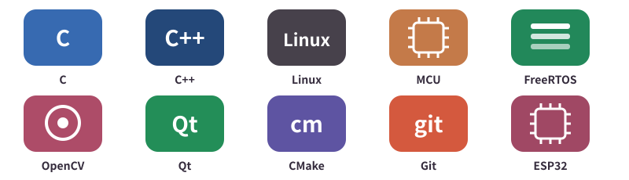
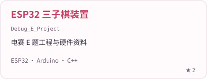
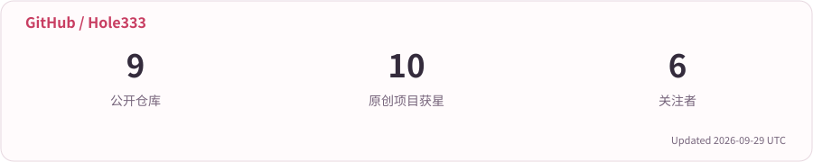
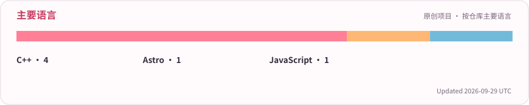

<picture>
  <source media="(prefers-reduced-motion: reduce)" srcset="assets/template/header-static.svg">
  
</picture>

# 👋 Hi, I'm Halo Moon

<picture>
  <source media="(prefers-reduced-motion: reduce)" srcset="assets/template/focus-static.svg">
  
</picture>

**嵌入式 Linux / MCU / FreeRTOS / 机器视觉**

  
  
  

<h2 align="center">🧩 方向</h2>

<table width="100%">
<tr>
<td width="50%" valign="top"><h3>🐧 嵌入式 Linux</h3>
驱动 · 设备树 · 硬件接口
</td>
<td width="50%" valign="top"><h3>🔧 MCU</h3>
外设 · 通信 · 板级调试
</td>
</tr>
<tr>
<td width="50%" valign="top"><h3>⏱ FreeRTOS</h3>
任务 · 队列 · 中断
</td>
<td width="50%" valign="top"><h3>👁 机器视觉</h3>
OpenCV · ONNX · 结构光
</td>
</tr>
</table>

<h2 align="center">🛠 技术与工具</h2>

<picture><source media="(prefers-color-scheme: dark)" srcset="assets/template/tools-dark.svg"></picture>

<h2 align="center">📌 项目与笔记</h2>

  <a href="https://github.com/Hole333/HaloMoon-Notes"><picture><source media="(prefers-color-scheme: dark)" srcset="assets/template/project-HaloMoon-Notes-dark.svg"></picture></a>
  <a href="https://github.com/Hole333/Debug_E_Project"><picture><source media="(prefers-color-scheme: dark)" srcset="assets/template/project-Debug_E_Project-dark.svg"></picture></a>
  <a href="https://github.com/Hole333/Controller"><picture><source media="(prefers-color-scheme: dark)" srcset="assets/template/project-Controller-dark.svg"></picture></a>
  <a href="https://github.com/Hole333/HK_Algorithm_Dev"><picture><source media="(prefers-color-scheme: dark)" srcset="assets/template/project-HK_Algorithm_Dev-dark.svg"></picture></a>
  <a href="https://github.com/Hole333/PostgraduateResearch"><picture><source media="(prefers-color-scheme: dark)" srcset="assets/template/project-PostgraduateResearch-dark.svg"></picture></a>
  <a href="https://github.com/Hole333/HaloMoon"><picture><source media="(prefers-color-scheme: dark)" srcset="assets/template/project-HaloMoon-dark.svg"></picture></a>

<h2 align="center">📊 GitHub 记录</h2>

<picture><source media="(prefers-color-scheme: dark)" srcset="assets/template/stats-dark.svg"></picture>

<picture><source media="(prefers-color-scheme: dark)" srcset="assets/template/languages-dark.svg"></picture>

🐍 贡献记录

<picture>
  <source media="(prefers-reduced-motion: reduce) and (prefers-color-scheme: dark)" srcset="assets/template/activity-static-dark.svg">
  <source media="(prefers-reduced-motion: reduce)" srcset="assets/template/activity-static-light.svg">
  <source media="(prefers-color-scheme: dark)" srcset="assets/template/snake-dark.svg">
  
</picture>

<a href="https://www.halomoon.cn/">halomoon.cn</a> · <a href="https://github.com/Hole333?tab=repositories">全部仓库</a>

模板设计灵感来源：© <a href="https://github.com/zyh3699">Zephyr Zhong</a> · <a href="https://github.com/Jeysom-feng/jeysom-github-io">参考模板</a>

<picture><source media="(prefers-reduced-motion: reduce)" srcset="assets/template/footer-static.svg"></picture>
